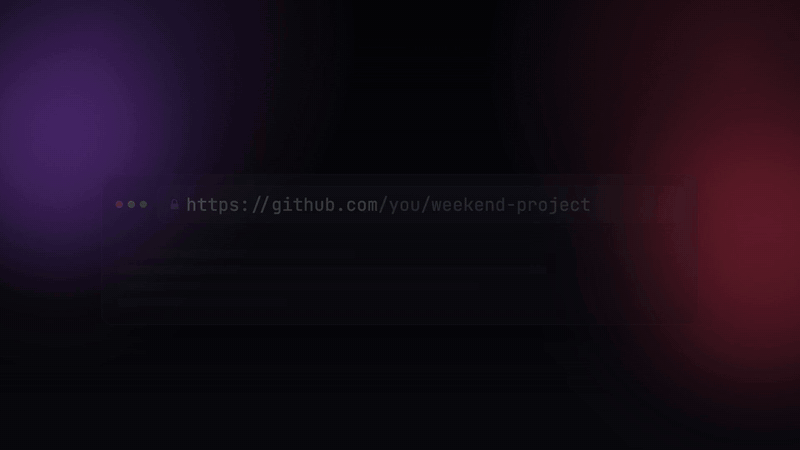

<div align="center">


<br />

# Vedocker

**A Docker and Kubernetes platform built from scratch in Go and Linux — with AI that can containerize any GitHub repo, even if it has no Dockerfile.**

<br />

[](https://golang.org)
[](https://kernel.org)
[](LICENSE)
[](#how-it-works)

<br />



**[▶ Watch the 20-second launch video (with sound)](assets/vedocker-launch.mp4)**

[How it works, layer by layer: I built my own Docker and Kubernetes from scratch](https://towardsaws.com/i-built-my-own-docker-and-kubernetes-system-from-scratch-and-you-can-too-759ffabe9993)

[Quickstart](#quickstart) · [The URL trick](#the-url-trick) · [Use cases](#what-you-can-do-with-it) · [How it works](#how-it-works) · [CLI reference](#cli-reference)

</div>

---

## What is Vedocker?

**Paste any GitHub link and get a running container, with or without a Dockerfile.**

Vedocker is a container platform written from the ground up in Go. It doesn't use Docker Engine, containerd or Kubernetes underneath. The runtime, image store, build engine, networking and orchestration are built directly on Linux namespaces, cgroups and iptables. Point it at a repo and it clones the repo, builds it and runs it. If the repo has no Dockerfile, Gemini writes one.

---

## The URL trick

Take any GitHub URL and swap `github.com` for your Vedocker dashboard:

```
https://github.com/owner/repo
        ↓
http://localhost:5173/github.com/owner/repo
```

Open it and Vedocker clones the repo, finds or generates a Dockerfile, builds the image, and starts the container.

The first time, the dashboard asks you to confirm. Tick **Always auto-deploy from the URL** and every URL after that deploys instantly. The prompt is on by default because the daemon runs repos as root, so a link someone else sends you shouldn't run code on your machine without asking.

These forms all work:

| URL | Deploys |
|-----|---------|
| `localhost:5173/github.com/owner/repo` | `github.com/owner/repo` |
| `localhost:5173/owner/repo` | `github.com/owner/repo` |
| `localhost:5173/github.com/owner/repo/tree/main` | `github.com/owner/repo` |
| `localhost:5173/?repo=https://github.com/owner/repo` | `github.com/owner/repo` |

> For repos without a Dockerfile, start the daemon with `GEMINI_API_KEY` set (see [Quickstart](#quickstart)) so URL deploys can use the AI fallback without a key typed into the UI.

---

## Quickstart

Requires **Linux** (namespaces, cgroups and iptables), **root**, **Go 1.25+**, **Node 18+** and **git**.

```bash
git clone https://github.com/Vedthakar/Vedocker.git
cd Vedocker

# 1. Build the CLI and the daemon
make build

# 2. Start the daemon (the Gemini key is optional and only used when a repo has no Dockerfile)
sudo GEMINI_API_KEY=your-key ./minicontainerd

# 3. Start the dashboard in a second terminal
make ui
```

Then open **http://localhost:5173/github.com/owner/repo**, or paste a link into the **Deploy GitHub Repo** box.

On ARM64 you can seed a local Alpine base image with `sudo ./scripts/bootstrap.sh`.

---

## What you can do with it

| You want to… | Do this |
|---|---|
| **Run a repo you just found** | Open `localhost:5173/github.com/owner/repo` |
| **Run a repo that has no Dockerfile** | Same thing. Gemini reads the repo, picks the stack, and writes a Dockerfile, which Vedocker validates before building |
| **Try a project before reading its setup docs** | Paste the link and watch the build and runtime logs in the dashboard |
| **Build an image from your own Dockerfile** | `sudo ./minicontainer image build -t my-app:v1 -f Dockerfile .` |
| **Run several replicas that self-heal** | `sudo ./minicontainer deploy apply -f webdeploy.yaml`. Kill a container and the reconcile loop starts a new one |
| **Learn how Docker and Kubernetes work inside** | Read the code. Every layer, from `clone(2)` flags to the reconcile loop, is here in plain Go |

---

## Features

- **Paste-a-link deploys.** Clone, detect, build, run and stream logs from one GitHub URL.
- **AI Dockerfile fallback.** Gemini analyzes the repo (language, framework, entrypoint, ports) and generates a Dockerfile, which is validated before the build.
- **From-scratch container runtime.** `create`, `start`, `stop`, `exec`, `logs` and `rm` are built on PID, mount and network namespaces plus cgroups. It does not use Docker Engine or containerd.
- **Own image store.** `pull`, `build`, `ls`, `inspect`, `import`, `export` and `rm`.
- **Dockerfile build engine.** Supports `FROM`, `WORKDIR`, `COPY` (with globs), `RUN` (multiline), `ENV`, `EXPOSE` and `CMD`, and pulls missing base images automatically.
- **Networking.** Each container gets its own network namespace and IP, and ports are published with iptables NAT.
- **Kubernetes-style orchestration.** Pods, Deployments, scaling, and a background reconcile loop that self-heals.
- **Live dashboard.** Docker and Kubernetes views, container controls, and stdout/stderr logs.

---

## How it works

```
GitHub URL (pasted, or read from the page URL)
  → daemon clones the repo
  → Dockerfile present?
      ├─ yes → use it
      └─ no  → Gemini analyzes the repo → generates a Dockerfile → validated
  → custom build engine creates the image
  → runtime starts it in fresh namespaces + cgroups
  → port published via iptables → logs streamed to the dashboard
```

```
┌───────────────────────────────────────────────────────────────┐
│ Dashboard (React + Vite)  ·  Docker view  ·  Kubernetes view  │
└──────────────────────────────┬────────────────────────────────┘
                               │ HTTP (127.0.0.1:18080)
┌──────────────────────────────▼────────────────────────────────┐
│ minicontainerd: containers · images · repo deploy · k8s API   │
└──┬──────────┬──────────┬──────────────┬───────────────────────┘
   │          │          │              │
 Runtime    Images    Builder     AI deploy (Gemini)    Orchestration
 ns+cgroups  store    Dockerfile  clone · detect · gen   pods · deploys
   │                                                     reconcile loop
 Networking: netns · veth · IP alloc · iptables NAT
```

<details>
<summary><b>Project layout</b></summary>

```
Vedocker/
├── main.go                 CLI entry point (minicontainer)
├── cmd/minicontainerd/     daemon + HTTP API
├── minicontainer-ui/       React + Vite dashboard
├── pkg/
│   ├── container/          runtime, build engine, rootfs, exec, networking glue
│   ├── cgroups/            CPU and memory limits
│   ├── network/            namespaces, IPs, iptables
│   ├── image/              image store + metadata
│   └── deploy/             repo context + Gemini Dockerfile generation
├── pod.go · deployment.go · service.go   orchestration objects
└── scripts/bootstrap.sh    Alpine base image setup (ARM64)
```

</details>

---

## CLI reference

```bash
# Images
sudo ./minicontainer image pull alpine:latest
sudo ./minicontainer image build -t my-app:v1 -f Dockerfile .
sudo ./minicontainer image ls

# Containers
sudo ./minicontainer create web -p 8080:8080 my-app:v1 /bin/sh -c "python3 -m http.server 8080"
sudo ./minicontainer start web
sudo ./minicontainer logs web
sudo ./minicontainer exec web /bin/sh
sudo ./minicontainer stop web && sudo ./minicontainer rm web

# Orchestration
sudo ./minicontainer pod apply -f hello-pod.yaml
sudo ./minicontainer pod get
sudo ./minicontainer deploy apply -f webdeploy.yaml   # edit replicas: and re-apply to scale
sudo ./minicontainer deploy get
sudo ./minicontainer deploy reconcile-all
```

<details>
<summary><b>Example Deployment (<code>webdeploy.yaml</code>)</b></summary>

```yaml
apiVersion: v1
kind: Deployment
metadata:
  name: webdemo
spec:
  replicas: 2
  template:
    image: python:3.12-alpine
    command: [/usr/local/bin/python3, -m, http.server, "8080", --bind, 0.0.0.0]
    ports: []
```

</details>

---

## Status

Working today: the runtime, image store, build engine, GitHub and AI deploy, URL-triggered deploys, the dashboard, pods, deployments, scaling, and self-healing reconcile.

Not done yet: multi-replica Service load balancing, which needs a redesign of the runtime networking model.

---

## Contributing

Found a repo that Vedocker can't run? [Open an issue](https://github.com/Vedthakar/Vedocker/issues) with the link. Those are the most useful bug reports. PRs are welcome.

If Vedocker saved you from reading a setup guide, a ⭐ helps other people find it.

<div align="center">

Built by [Ved Thakar](https://github.com/Vedthakar)

</div>
